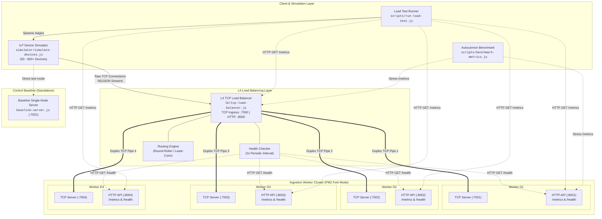
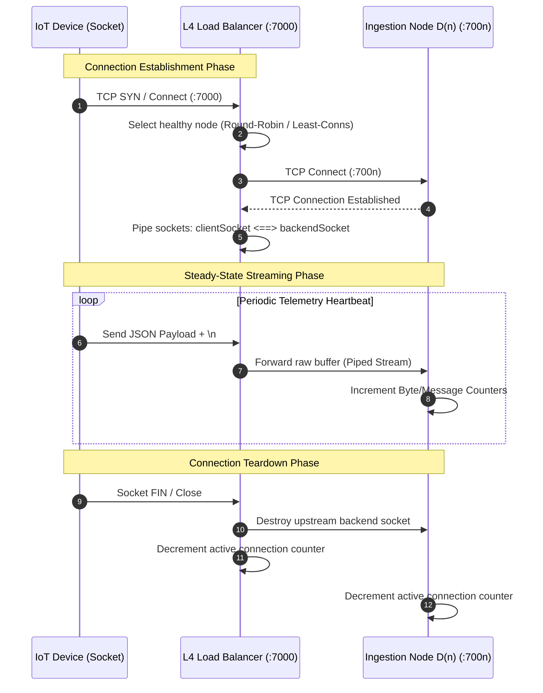

# Project Architecture Documentation

## 1. Overview

- **Project Name:** IoT Telemetry Ingestion Pipeline (Phase 1: TCP Load Distribution)
- **Purpose:** A high-throughput, low-latency Layer 4 (L4) TCP connection distribution and telemetry ingestion prototype designed to test socket stickiness, process isolation, failover mechanics, and real-time observability across horizontally scaled worker nodes on a local development environment.
- **Tech Stack:**
  - **Runtime:** Node.js (v18+)
  - **Core Protocols:** Raw TCP (`net` module), HTTP/1.1 (`http` module)
  - **Process Management & Clustering:** PM2 (Fork Mode)
  - **Performance Benchmarking:** Autocannon, custom multi-stage connection ramp runners
  - **Data Serialization:** Newline-delimited JSON (NDJSON) streaming payloads

### High-Level Summary
The system provides a scalable L4 TCP ingestion layer for IoT device telemetry streams. Simulated IoT devices establish persistent TCP connections to an entry-point L4 Load Balancer, which distributes sockets across isolated Ingestion Nodes (`D1` through `D4`) using configurable load-balancing algorithms (Round-Robin or Least-Connections). Each connection maintains persistent socket-level stickiness via bidirectional streaming pipes, while nodes independently compute real-time throughput metrics and expose dedicated HTTP health and monitoring endpoints without blocking the core TCP event loop.

---

## 2. Folder Structure

```text
tcp_through_put/
├── baseline-server.js             # Standalone single-process TCP server for baseline benchmark comparisons
├── ecosystem.config.js            # PM2 orchestration manifest running Ingestion Nodes D1..D4 in isolated fork mode
├── FINDINGS.md                    # Benchmark analysis and bottleneck comparison between single-node and distributed tiers
├── README.md                      # Quick-start guide, operational procedures, and runbook
├── package.json                   # Project metadata, npm run scripts, and dependencies (PM2, Autocannon)
├── package-lock.json              # Locked dependency graph for deterministic installs
├── ingestion-node/
│   └── node.js                    # Core worker process managing raw TCP socket ingestion and HTTP /metrics & /health
├── lb/
│   └── tcp-load-balancer.js       # Custom L4 TCP load balancer with active health probing and full-duplex socket piping
├── scripts/
│   ├── benchmark-metrics.js       # Autocannon stress-test script evaluating HTTP observability endpoint throughput
│   └── run-load-test.js           # Automated multi-stage device ramp suite (50 -> 800 connections) with metrics aggregation
└── simulator/
    └── simulate-devices.js        # IoT device client simulator streaming periodic JSON telemetry heartbeats over TCP
```

---

## 3. Component Breakdown

### 1. L4 TCP Load Balancer
- **Location:** `lb/tcp-load-balancer.js`
- **Purpose/Function:** Acts as the central traffic ingress point on port `7000`. It accepts incoming client TCP connections, evaluates the health state and current connection counts of downstream nodes, selects an available node using Round-Robin or Least-Connections, and bridges the client socket with an upstream worker socket using bidirectional stream piping (`clientSocket.pipe(backendSocket)` & `backendSocket.pipe(clientSocket)`). It also runs background health probes against backend HTTP endpoints and exposes an HTTP metrics interface on port `8000`.
- **Depends on:** Node.js standard modules (`net`, `http`); backend ingestion nodes (`D1`..`D4`).
- **Used by:** Simulated IoT devices (`simulator/simulate-devices.js`) and load test runners (`scripts/run-load-test.js`).

---

### 2. Ingestion Node Worker
- **Location:** `ingestion-node/node.js`
- **Purpose/Function:** Reusable ingestion worker instantiated across multiple distinct processes (`D1`, `D2`, `D3`, `D4`). Each instance binds to a dedicated TCP port (`7001`–`7004`) for raw telemetry stream ingestion and an independent HTTP port (`8001`–`8004`) for `/metrics` and `/health` requests. The worker parses message counts via newline delimiters in chunks without executing heavy deserialization, tracking aggregate throughput, active connections, RSS memory, and CPU usage.
- **Depends on:** Node.js standard modules (`net`, `http`).
- **Used by:** Managed by PM2 via `ecosystem.config.js`; receives TCP traffic and health probes from `lb/tcp-load-balancer.js`.

---

### 3. PM2 Process Orchestration Configuration
- **Location:** `ecosystem.config.js`
- **Purpose/Function:** Defines the process topology for horizontally scaled ingestion nodes. Configures 4 independent application instances (`ingestion-d1` through `ingestion-d4`) in PM2 `fork` mode (avoiding cluster-mode shared socket state), allocating distinct TCP/HTTP port configurations, memory boundaries (`max_memory_restart: '300M'`), and environment variables.
- **Depends on:** `pm2` runtime; targets `ingestion-node/node.js`.
- **Used by:** Developers/operators starting or stopping the cluster using `npm run start:pm2` / `pm2 start ecosystem.config.js`.

---

### 4. IoT Device Connection Simulator
- **Location:** `simulator/simulate-devices.js`
- **Purpose/Function:** High-concurrency client simulator generating realistic IoT traffic. Capable of ramping from 50 to 800+ persistent TCP connections at controlled rates (e.g., 100–180 conns/sec). Each simulated device maintains a persistent socket, periodically emits newline-delimited JSON telemetry payloads (device ID, timestamp, sequence number, temperature, battery level, status), handles reconnections, and renders a real-time terminal progress bar.
- **Depends on:** Node.js standard module (`net`).
- **Used by:** Standalone CLI simulations and automated test scripts (`scripts/run-load-test.js`).

---

### 5. Automated Load Test Runner
- **Location:** `scripts/run-load-test.js`
- **Purpose/Function:** Orchestrates progressive end-to-end load testing across staged connection targets (50 $\rightarrow$ 100 $\rightarrow$ 200 $\rightarrow$ 400 $\rightarrow$ 800 devices). Spawns the device simulator, samples intermediate steady-state metrics from the Load Balancer and all Ingestion Node HTTP endpoints (`8001`–`8004`), calculates cluster-wide averages, and outputs a formatted summary table of throughput, memory, and CPU metrics.
- **Depends on:** `simulator/simulate-devices.js`, `lb/tcp-load-balancer.js` (HTTP metrics), `ingestion-node/node.js` (HTTP metrics).
- **Used by:** Developers/CI via `npm run test:load`.

---

### 6. Observability Metrics Benchmark Suite
- **Location:** `scripts/benchmark-metrics.js`
- **Purpose/Function:** Benchmarks the HTTP `/metrics` endpoints of the Load Balancer (port `8000`) and Ingestion Nodes (port `8001`) using `autocannon`. Validates that high-frequency metric polling (up to ~9,000 req/s) can occur concurrently with heavy TCP ingestion without introducing event loop lag or socket contention.
- **Depends on:** `autocannon`, running instances of `lb/tcp-load-balancer.js` and `ingestion-node/node.js`.
- **Used by:** Developers/evaluators via `npm run test:metrics`.

---

### 7. Baseline Single-Node Ingestion Server
- **Location:** `baseline-server.js`
- **Purpose/Function:** A monolithic single-process TCP ingestion server operating on port `7001`. Serves as the control group baseline to measure maximum throughput, CPU overhead, and memory efficiency of a single Node.js event loop before introducing the L4 proxy layer and multi-process distribution.
- **Depends on:** Node.js standard module (`net`).
- **Used by:** Benchmark runs via `npm run baseline`.

---

## 4. Architecture Diagram

### Combined System Architecture



### Connection Lifecycle & Stream Pipe Flow



---

## 5. Data Flow Explanation

### 1. Connection Establishment & Sticky Routing
1. An IoT device client initiates a TCP socket connection targeting the Load Balancer on `tcp://127.0.0.1:7000`.
2. The Load Balancer executes `getNextBackend()`, filtering out any nodes marked unhealthy. Based on the selected algorithm:
   - **Round-Robin:** Cycles through the index of healthy nodes.
   - **Least-Connections:** Selects the healthy node with the lowest `activeConns` count.
3. The Load Balancer opens an upstream TCP socket connection to the selected backend (`tcp://127.0.0.1:7001-7004`).
4. Once connected, full-duplex piping is configured: `clientSocket.pipe(backendSocket)` and `backendSocket.pipe(clientSocket)`.
5. This guarantees **connection-level stickiness**: all subsequent telemetry frames from this client socket flow directly to the same worker node for the entire lifetime of the connection.

### 2. Telemetry Streaming & Ingestion
1. The IoT device transmits JSON telemetry packets terminated with a newline (`\n`) every interval (e.g., 1,000 ms).
2. The Load Balancer streams the raw binary buffer directly to the worker node without deserializing or altering the buffer payload, incrementing `totalBytesBridged`.
3. The Ingestion Node receives the chunk in its `socket.on('data')` handler:
   - Scans byte values for newline characters (`ASCII 10`) to compute message counts.
   - Updates `messagesInLastSecond`, `bytesInLastSecond`, `totalMessages`, and `totalBytes`.
   - Bypasses JSON deserialization overhead to preserve maximum socket throughput.

### 3. Health Checking & Failover Flow
1. Every 2 seconds (`setInterval(runHealthChecks, 2000)`), the Load Balancer issues concurrent `HTTP GET` requests to each worker's `/health` endpoint (`http://127.0.0.1:8001-8004/health`).
2. If an HTTP response returns `200 OK` within a 1,500 ms timeout window, the backend is marked `healthy = true`.
3. If an endpoint errors, times out, or returns a non-200 code (e.g., when a worker is terminated via `pm2 stop ingestion-d2`):
   - The Load Balancer logs a warning and marks `healthy = false`.
   - `getNextBackend()` automatically excludes the failed node from future routing decisions.
   - When the worker restarts and the health probe succeeds, it is automatically marked `healthy = true` and rejoins the active rotation.

### 4. Observability & Metrics Collection
1. Every 1,000 ms, each Ingestion Node and the Load Balancer compute instantaneous snapshot rates (`messagesPerSec`, `bytesPerSec`, `cpuPercent`, and `memory.rssMB`).
2. Scrapers and test runners query `/metrics` over HTTP:
   - Load Balancer exposes cluster-level connection counts, bytes bridged, and per-backend status.
   - Ingestion Nodes expose granular memory (RSS, Heap Used, Heap Total), CPU utilization, and message rates.
3. Because the HTTP servers run independently of the TCP streams within each process's event loop, metrics collection executes with sub-millisecond latencies (~1.7–2.1 ms average).

---

## 6. External Dependencies & Integrations

### Key Libraries & Packages

| Package | Version | Type | Purpose |
| :--- | :--- | :--- | :--- |
| **`pm2`** | `^5.4.3` | Production Dependency | Process supervisor used to launch, isolate, auto-restart, and monitor multiple Ingestion Node workers in `fork` mode with custom memory constraints. |
| **`autocannon`** | `^7.15.0` | Development Dependency | High-performance HTTP benchmarking tool used in `scripts/benchmark-metrics.js` to stress-test the `/metrics` API under high concurrency. |
| **`net`** | Built-in | Core Node.js API | Core network module utilized across the LB, nodes, baseline server, and simulator for raw TCP socket creation, streaming, and connection state management. |
| **`http`** | Built-in | Core Node.js API | Core HTTP module used to serve `/health` and `/metrics` REST endpoints and run periodic health probes. |
| **`child_process`**| Built-in | Core Node.js API | Used by `scripts/run-load-test.js` to orchestrate device simulator subprocesses across ramping stages. |

### Architectural Decoupling & Phase 1 Scope

To measure and isolate pure L4 socket distribution and OS-level network throughput, the following integrations were **deliberately kept out of scope** in Phase 1:
- **Message Queues (Kafka / RabbitMQ):** Out of scope to prevent message broker serialization and disk I/O bottlenecks from masking TCP socket limits.
- **Databases (PostgreSQL / ClickHouse):** Storage persistence is isolated for downstream phases.
- **Caching Layer (Redis):** Node state and telemetry counters are retained purely in-memory.
- **Heavy Payload Deserialization:** Raw buffer newline scanning is used in lieu of `JSON.parse()` per message to benchmark raw network transfer rates.

---

## 7. Entry Points & Startup Lifecycle

| Entry Point | Command | Execution Mechanism | Role & Startup Sequence |
| :--- | :--- | :--- | :--- |
| **PM2 Cluster** | `npm run start:pm2` | `pm2 start ecosystem.config.js` | Reads `ecosystem.config.js` and spawns 4 isolated Node.js child processes (`D1`–`D4`). Each initializes a TCP listener on `:7001–:7004` and an HTTP listener on `:8001–:8004`. |
| **TCP Load Balancer** | `npm run lb` | `node lb/tcp-load-balancer.js` | Binds TCP server on port `7000` and HTTP server on `8000`. Immediately executes initial health probes against `D1`–`D4` and starts the 2s probing timer. |
| **Device Simulator** | `npm run simulate` | `node simulator/simulate-devices.js` | Parses CLI flags (`--connections`, `--port`, `--ramp-rate`), begins ramping device socket creation against `:7000`, and starts the live terminal dashboard. |
| **Load Test Suite** | `npm run test:load` | `node scripts/run-load-test.js` | Probes LB health on `:8000`, sequentially executes stages (`50` $\rightarrow$ `800` connections), polls HTTP metrics mid-stage, and renders the consolidated benchmark table. |
| **Metrics Benchmark** | `npm run test:metrics` | `node scripts/benchmark-metrics.js` | Fires concurrent `autocannon` HTTP load against `http://127.0.0.1:8000/metrics` and `http://127.0.0.1:8001/metrics`. |
| **Baseline Control** | `npm run baseline` | `node baseline-server.js` | Launches single monolithic TCP server on `:7001` for comparative baseline performance analysis. |

---

## 8. Design Patterns Used

1. **L4 Reverse Proxy & Bidirectional Stream Piping:**
   - The Load Balancer acts as an L4 stream proxy. Instead of buffering entire messages, it uses Node.js Stream piping (`clientSocket.pipe(backendSocket)` and vice versa) to stream TCP buffers directly, minimizing user-space memory copies and latency.

2. **Connection Stickiness (Stateful Socket Affinity):**
   - Telemetry devices require long-lived TCP sessions. Once the LB assigns a socket to a specific node at connection time, the socket pairing remains fixed for the duration of the TCP session.

3. **Split Control Plane and Data Plane:**
   - Raw, high-volume device telemetry is routed over raw TCP (Data Plane), while health monitoring, cluster orchestration, and Prometheus-style metrics scraping occur over lightweight HTTP endpoints (Control Plane) on separate ports.

4. **Multi-Process Isolation (Fork Mode Worker Pattern):**
   - Rather than sharing a single V8 heap or using Node.js cluster-mode shared socket handles, workers run as completely separate OS processes via PM2 fork mode. A failure, high GC pause, or memory leak in one worker cannot corrupt the runtime state of adjacent nodes.

5. **Strategy Pattern (Load Balancing Algorithms):**
   - The routing module supports swappable selection algorithms via the `--algo` flag (`round-robin` or `least-connections`), allowing flexible runtime tuning based on workload characteristics.

6. **Active Health Probing & Dynamic Service Discovery:**
   - The LB performs background polling of worker `/health` endpoints. It dynamically removes failed nodes from the routing pool and automatically restores them upon recovery without requiring process restarts.

7. **Leaky-Bucket / Controlled Rate-Limited Ramping:**
   - The device simulator applies rate-controlled connection spawning (`rampNext()` using `RAMP_RATE`) to prevent TCP SYN floods and local ephemeral port exhaustion during high-concurrency connection ramp-ups.
